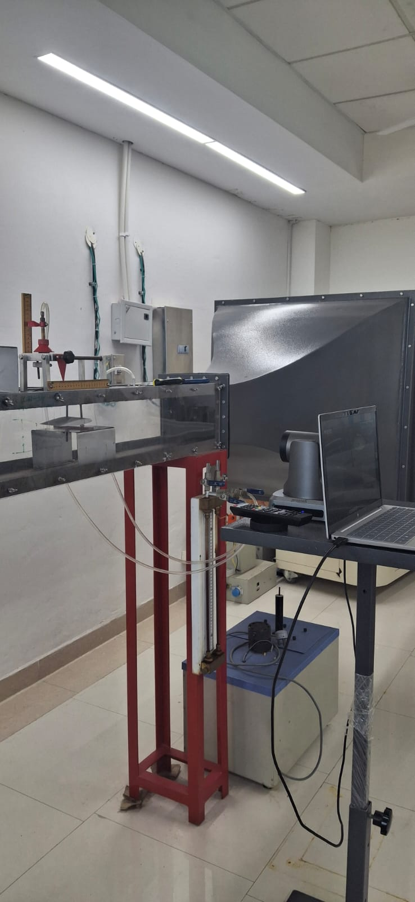

# Powered Lift Wing Design


Aerodynamic and propulsion study for a STOL aircraft achieving extreme lift coefficients through Distributed Electric Propulsion (DEP) and blown flap augmentation. Validated through mathematical modeling, CFD, and wind tunnel testing.

---

## Problem Statement

Design a fixed wing combined with a thrust-producing device to achieve a lift coefficient ≥ 6.5 at 20 m/s freestream, L/D > 5 with flaps deployed, and L/D > 20 in cruise.

**Selected configuration:** Distributed Electric Propulsion (DEP) with blown flaps over a NACA 4412 wing. Propellers along the leading edge accelerate flow over the wing and flaps, decoupling lift generation from freestream velocity-the core requirement for STOL.

---

## 📁 Repository Structure

### Root Files
- **requirements.txt**-Python dependencies
- **README.md**-Project documentation

---

## ✈️ `wing/`-Wing Aerodynamics & DEP Studies

Wing lift is modeled from first principles using **thin airfoil theory (Glauert's vortex sheet method)**, progressively extended through three configurations:

- **Bare wing**-vortex sheet on the camber line, validated against ANSYS CFD
- **Wing with flaps**-flap deflection superimposed on camber geometry at the hinge point
- **Blown wing**-jet-airfoil interaction via a momentum-excess coefficient, extending Courtin's (MIT, 2019) flat-airfoil model to cambered airfoils

The 2D blown section model is embedded in a **Prandtl lifting-line framework** for 3D finite wing analysis, with a spanwise-varying lift slope extracted from the blown airfoil model.

### Aerodynamic Results

| Configuration        | CL    | L/D   |
|----------------------|-------|-------|
| Bare wing (α = 10°)  | 1.165 | 14.9  |
| With flaps (δ = 30°) | 1.761 | 12.4  |
| Blown flap (takeoff) | 7.056 | 5.10  |
| Cruise (no flaps)    | 0.612 | 57.97 |

### Key Files
- **Airfoils/**-Airfoil coordinate files for wing analysis
- **DEP_2D.py**-2D DEP aerodynamic analysis
- **DEP_takeoff.py**-Takeoff condition analysis for the chosen DEP configuration
- **DEP_cruise.py**-Cruise condition analysis for the chosen DEP configuration
- **DEP_paper_2D_flat.py**-Evaluates Spence's flat blown airfoil formula for baseline comparison
- **VSM_wing.py**-Full Vortex Sheet Method wing model (3D lifting-line)
- **VSM_wing_simplified.py**-Simplified VSM solver
- **VLM_2d.ipynb**-2D Vortex Lattice Method notebook
- **helper.py**-Shared utility to read camber line from CSV

---

## ✈️ `wing_no_jet/`-Baseline Wing (No Propeller Effects)

Wing aerodynamic analysis excluding jet/propeller slipstream, used for baseline comparisons against the blown configurations.

### Key Files
- **Airfoils/**-Airfoil datasets
- **Gamma.py**-Circulation distribution calculation
- **extraction.py**-Data extraction and post-processing
- **helper.py**-Utility functions

---

## 🚀 `propulsion/`-Propeller & BEMT Analysis

Propeller performance predicted using **Blade Element Momentum Theory (BEMT)**, combining actuator disk momentum theory with 2D airfoil aerodynamics at each radial station. The inflow angle at each blade element is solved iteratively using the Regula Falsi method, with Prandtl tip-loss and Glauert corrections applied.

The BEMT solver was validated against NACA TR-594 wind tunnel data (Clark Y propeller). Open propellers were chosen over EDFs-better suited for the low-speed, high-static-thrust regime STOL demands.

### Propeller Performance

| Condition | Thrust | RPM   | Efficiency |
|-----------|--------|-------|------------|
| Takeoff   | 90.7 N | 15316 | 23.4%      |
| Cruise    | 75.0 N | 18368 | 54.0%      |

### Key Files
- **Airfoils/**-Airfoil coordinate data for propeller sections
- **Propeller/**-Custom propeller geometry and related data
- **bemt_dynamic_airfoil_optimization.py**-BEMT-based collective and RPM optimization for the custom propeller
- **bemt_general_optimization.py**-BEMT optimization for a general NACA 4412 propeller
- **bemt_rmit.py**-Algorithm validation against RMIT paper data
- **bemt_with_xfoil.py**-BEMT coupled with XFOIL for viscous airfoil data
- **xfoil_final.py**-Python wrapper for running XFOIL
- **propeller_data.csv**-Propeller performance measurements from RMIT paper

---

## 🛩️ ANSYS Simulation Files

All simulations run in **ANSYS Fluent 2025 R2 (Student)**.

| Case | File | Key Result |
|------|------|------------|
| Isolated propeller | `propeller_simulation.zip` | T = 18.24 N |
| Wing without blown effects | `wing_simulation.zip` | CL = 1.165 |
| Wing with DEP blown effects | `dep_simulation.zip` | CL = 6.528 |

---

## Wind Tunnel Testing

Physical validation was carried out on a scaled model to complement the CFD results.


<!-- Add results/instrumentation image here -->
<!--  -->

---

## ⚙️ Setup & Usage

```bash
pip install -r requirements.txt

# Run propeller optimization
cd propulsion
python bemt_general_optimization.py

# Run wing takeoff analysis
cd wing
python DEP_takeoff.py
```

---

## References

- Winarto, H.-*BEMT Algorithm for the Prediction of the Performance of Arbitrary Propellers*, 2004
- Courtin, C. B. & Hansman, R. J.-*An Assessment of Electric STOL Aircraft*, MIT, 2019
- Spence, D. A.-*The Lift Coefficient of a Thin, Jet-Flapped Wing*, 1956
- Leishman, J. G.-*Principles of Helicopter Aerodynamics*, Cambridge University Press
- NACA TR-594-Propeller wind tunnel validation data

---

*Submitted as a solution to the LAT Aerospace High-Prep problem statement at Inter IIT Tech Meet 14.0, IIT Patna, December 2024.*